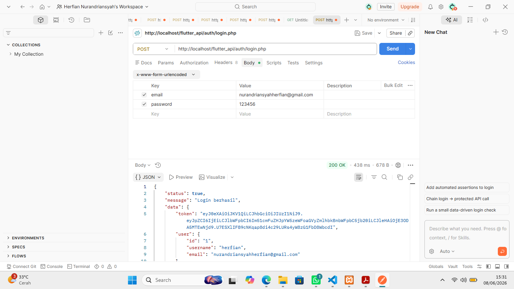

# Tugas 9 - Flutter Auth + PHP API

## 📱 Flutter App

Folder: `flutter_app/`

- Login & Register UI
- Integrasi API dengan HTTP
- Simpan token JWT di SharedPreferences

## 🌐 Backend API

Folder: `flutter_api/`

- PHP + MySQL
- Auth (login, register)
- JWT Middleware

## 🚀 Cara Menjalankan

1. Jalankan XAMPP → aktifkan Apache & MySQL.
2. Import database `flutter_api.sql`.
3. Jalankan Flutter:
   ```bash
   cd flutter_app
   flutter run
   tugas9_flutter_auth/
   │
   ├── flutter_app/        # Project Flutter
   │   ├── lib/
   │   ├── pubspec.yaml
   │   └── ...
   │
   ├── flutter_api/        # Backend PHP
   │   ├── auth/
   │   │   ├── login.php
   │   │   ├── register.php
   │   ├── config/
   │   │   └── database.php
   │   └── ...
   │
   └── screenshot/
    └── postman_login.png
    .png
   ```

---

## 🔑 API Test (Postman)

Berikut hasil uji login API menggunakan Postman:


